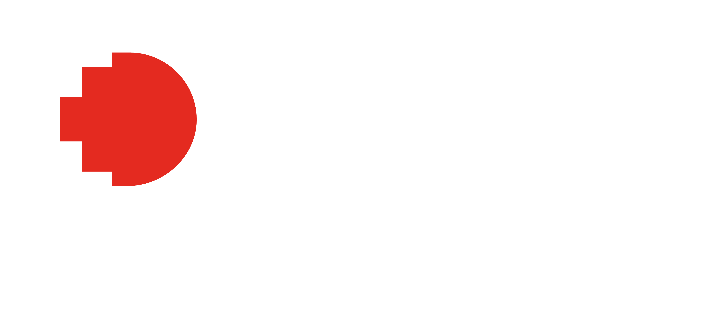

<p align="center">
  
</p>

<hr>

# Car Dealership Management System
### RMIT University Vietnam
### COSC2081 - Programming 1
**Instructors:** Mr. Minh Vu & Mr. Dung Nguyen

**Group:** Team 2

<hr>

## Project Overview
<p>Modern technology is evolving day by day including the up-and-rising automotive industry and yet many established dealerships like Auto136, a family-owned business with over 20 years of history, still rely on manual processes for managing operations. Thus, this overreliance on outdated systems has led to multiple inefficiencies such as scheduling, conflicts, lost information, or even delayed processing of sales and services. With the view of battling these challenges, we have put our resources to focus on developing a Car Dealership Management System tailored to streamline internal operations at Auto136 which will implement both Java and OOP techniques to make a text-based application.
Our main aim would be to create a solution that assists dealership personnel in efficiently managing service appointments as well as maintaining a pinpoint accuracy in sales transaction records. To start, the system will aid in the management of automobiles with their parts, services, and transactions. Moreover, with the consideration of monitoring business performance in mind, managers and employees will be provided with a variety of statistical operations. Therefore, we will focus on exploring the system's technical architecture and give a summary of the design together with our project development timeline in the following sections of the report.
The development of the Car Dealership Management System is driven by the collaborative efforts of the team, each carrying unique expertise to the project. Huy serves as the main coder and project manager. Working with Hai, he is also responsible for assisting in creating the initial code templates, implementing the user management system, and setting up the project database. The management of the project timeline, integration of different components, and assignment of tasks to team members are also overseen by Huy. Complementing Huy’s work, Hai plays a crucial role as the main coder/debugger, focusing on enhancing the system's stability and reliability. He tackles bugs by implementing input validation methods and resolving potential errors, ensuring robust error handling across the application while leading the technical works. Meanwhile, Dzi and Tram Anh contribute as sub-developers specializing in CRUD (Create, Read, Update, Delete) methods. Dzi develops these methods for the service and auto part modules and is also responsible for preparing video demonstrations. Tram Anh focuses on CRUD methods for transactions and car functions and also serves as the report writer and adjustor. Through the combined efforts, our team is building a comprehensive solution that aims to enhance operational efficiency and modernize automotive management for Auto136. 
</p>

<hr>

## Team Members
- Pham Le Gia Huy (s3975371)
- Nguyen Tien Hai (s3979239)
- Nguyen Thach Khanh Dzi (s3980883)
- Lam Quang Tram Anh (s4023681)

<hr>

## Table of Contents
- [Installation](#installation)
- [Usage](#usage)
- [Documentation](#documentation)
- [Video Demonstration](#video-demonstration)
- [License](#license)

<hr>

<h2 id="installation"> Installation </h2>

1. Clone this repository using the following command:
   ```bash
    git clone https://github.com/RMIT-PROG1-CARMANA/Car-Dealership-Management-System

2. Navigate to the project directory:
   ```bash
   cd Car-Dealership-Management-System/out/production/Car-Dealership-Management-System

3. Compile the Java files:
   ```bash
   javac *.java

4. Run the application:
   ```bash
   java Main

<hr>

<h2 id="usage">Usage</h2>

<p>Follow the on-screen prompts to navigate through the various functionalities of the car dealership management system.</p>

<hr>

<h2 id="documentation">Documentation</h2><br>

You can view the full documentation [here](https://docs.google.com/document/d/1h8TlfPHYGuv-r4O6T3_COMHmVhv3RUYB0CAX34bX7X8/edit).

<hr>

<h2 id="video-demonstration">Video Demonstration</h2><br>

A demonstration video of the project can be found [here](#).

<hr>

<h2 id="license">License</h2>

This project is licensed under [MIT License](LICENSE.md).

<hr>

For any additional information or queries, please contact **s3975371@rmit.edu.vn**.

## GitHub Repository
[Car Dealership Management System GitHub Repository](https://github.com/RMIT-PROG1-CARMANA/Car-Dealership-Management-System)


